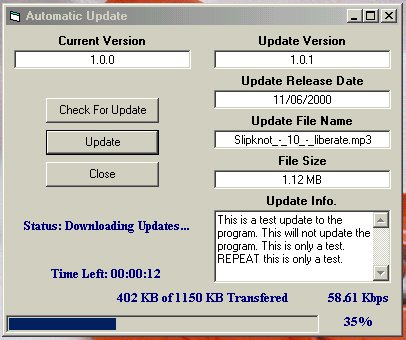



## Automatic Updater via FTP with Progrees Bar and Status \(Much More\)

### Description

UPDATED 11/10/2000 Now With even more options!! This application allows you to check for an updated version of a file or a program via FTP, then download that update if it is available. It works by reading a file called update.inf that must be installed on the remote server and comparing information in that file to information about the current version of the file or program. The author has set up a remote FTP site with such an update.inf file on it for testing purposes so you can see how it works. Information about this remote FTP site (IP address and remote directory) is contained in a file called update.ini

In the example, as it is written, the program compares the version of the application itself to information in the update.inf file on the remote machine. However, this is for testing purposes only and the program does not actually update itself. To use the program in a production setting, you have to set up an FTP site, put the appropriate information in the update.inf and update.ini files, and change the code to refer to the file or program that you would actually want to update.
 
### More Info
 

             |
---                |---
**Submitted On**   |2000-11-09 18:53:16
**By**             |[Shane Croft](https://github.com/Planet-Source-Code/PSCIndex/blob/master/ByAuthor/shane-croft.md)
**Level**          |Intermediate
**User Rating**    |4.8 (100 globes from 21 users)
**Compatibility**  |VB 6\.0
**Category**       |[Internet/ HTML](https://github.com/Planet-Source-Code/PSCIndex/blob/master/ByCategory/internet-html__1-34.md)
**World**          |[Visual Basic](https://github.com/Planet-Source-Code/PSCIndex/blob/master/ByWorld/visual-basic.md)
**Archive File**   |[CODE\_UPLOAD115251192000\.zip](https://github.com/Planet-Source-Code/shane-croft-automatic-updater-via-ftp-with-progrees-bar-and-status-much-more__1-12651/archive/master.zip)

